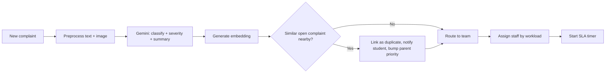

# Smart Hostel Complaint Management Platform
### Architecture & Build Plan (for building with Google Antigravity)

---

## 1. Goal and approach

Students report hostel issues (room, electricity, plumbing, sanitation, food, internet, security). AI classifies, prioritises, de-duplicates and routes each complaint to the right maintenance team. Admins track SLAs, escalations, analytics and insights.

**Design principles (hackathon-friendly)**
- **Modular monolith**: one backend, clean modules. No microservices.
- **One database** (PostgreSQL) for data, vectors and audit logs.
- **AI as a service layer** with a rule-based fallback, so the demo never breaks.
- **Spec first**: write this document into the repo so Antigravity agents build against it.

---

## 2. Tech stack

| Layer | Choice | Why |
|---|---|---|
| Frontend | React + Vite + Tailwind + Recharts | Fast UI, charts for dashboards |
| Backend | Node.js + Express (TypeScript) | Matches your Node.js skills |
| Database | PostgreSQL + `pgvector` | Relational data and duplicate-detection embeddings in one place |
| ORM | Prisma | Schema-first, easy migrations |
| Auth | JWT (access + refresh), bcrypt, RBAC middleware | Simple and secure |
| Real-time | Socket.IO | Live status updates and notifications |
| Jobs / SLA | BullMQ + Redis (or `node-cron` for MVP) | SLA timers, escalation, retries |
| AI | Gemini API (structured JSON output, multimodal, embeddings) | Same ecosystem as Antigravity |
| Files | Local disk for demo, S3-compatible or Google Cloud Storage for production | Image and attachment support |
| Notifications | In-app (Socket.IO) + email (Nodemailer) | Covers student alerts |
| Deploy | Docker Compose, then Render / Railway / Cloud Run | One command to run everything |

---

## 3. System architecture

```mermaid
flowchart TB
  subgraph Client
    S[Student Web App]
    A[Admin Dashboard]
    M[Maintenance Dashboard]
  end

  subgraph Backend["Node.js API (modular monolith)"]
    GW[Auth + RBAC + Validation]
    CM[Complaint Module]
    HM[Hostel/Room Module]
    WF[Workflow + SLA Engine]
    AI[AI Service]
    NT[Notification Service]
    AN[Analytics + Reports]
    AU[Audit Logger]
  end

  subgraph Data
    PG[(PostgreSQL + pgvector)]
    RD[(Redis / BullMQ)]
    FS[(File Storage)]
  end

  G[Gemini API]

  S --> GW
  A --> GW
  M --> GW
  GW --> CM & HM & AN
  CM --> AI --> G
  CM --> WF --> RD
  WF --> NT
  CM --> PG
  AN --> PG
  CM --> FS
  CM & WF --> AU --> PG
  NT -. Socket.IO .-> S & A & M
```

---

## 4. Module breakdown (mapped to deliverables)

| Module | Responsibilities | Deliverables covered |
|---|---|---|
| **Auth & Users** | Registration, login, JWT, password reset, roles (Student, Admin/Warden, Maintenance Staff, Super Admin) | Student registration and authentication, RBAC, secure data |
| **Hostel Management** | Hostel, Block, Floor, Room CRUD; student-to-room allocation | Hostel/block/floor/room management, location identification |
| **Category Management** | Categories, subcategories, default team, default SLA | Category and subcategory management |
| **Complaint** | Create (text, images, attachments), room auto-fill, search, filters, history | Complaint submission, attachments, search and filtering, history |
| **AI Service** | Classify, score severity, detect duplicates, summarise, generate insights | AI classification, priority, duplicates, summaries, insights |
| **Routing & Assignment** | Rule-based team routing plus workload-based staff assignment | Automatic routing, maintenance-team assignment |
| **Workflow & SLA** | State machine, SLA timers, escalation levels | Status workflow, SLA tracking, escalation |
| **Notifications** | Real-time and email alerts | Real-time updates, student notifications |
| **Feedback** | Rating and comment after resolution, reopen option | Student feedback and satisfaction |
| **Analytics & Reports** | Dashboards, recurring issues, workload, avg resolution time, CSV/PDF export | Dashboards, analytics, reports and export |
| **Audit** | Immutable log of every action | Audit trail |

---

## 5. Data model (core tables)

```
users(id, name, email, password_hash, role, phone, created_at)
hostels(id, name, type, warden_id)
blocks(id, hostel_id, name)
floors(id, block_id, number)
rooms(id, floor_id, room_no, capacity)
room_allocations(id, room_id, student_id, from_date, to_date)

categories(id, name, default_team_id, default_sla_hours)
subcategories(id, category_id, name, base_severity)

teams(id, name, category_ids[], head_id)
team_members(id, team_id, user_id, active, current_load)

complaints(id, student_id, room_id, hostel_id, category_id, subcategory_id,
           title, description, severity, priority_score, status,
           ai_category, ai_confidence, ai_summary,
           duplicate_of_id, embedding vector(768),
           assigned_team_id, assigned_to, sla_due_at, escalation_level,
           created_at, resolved_at, closed_at)
complaint_attachments(id, complaint_id, url, mime_type, size)
complaint_events(id, complaint_id, actor_id, action, from_status, to_status,
                 note, created_at)            -- also serves as audit trail
feedback(id, complaint_id, rating, comment, created_at)
notifications(id, user_id, complaint_id, message, read, created_at)
escalations(id, complaint_id, level, reason, escalated_to, created_at)
insights(id, scope, period, summary_text, created_at)
```

**Indexes**: `complaints(status, hostel_id, category_id)`, `complaints(sla_due_at)`, HNSW or IVFFlat index on `embedding`.

---

## 6. AI pipeline

Runs asynchronously right after a complaint is submitted. The student sees "Submitted" immediately, then gets AI results through a live update.



**6.1 Classification, severity and summary**
One Gemini call with a strict JSON schema:
```json
{
  "category": "plumbing",
  "subcategory": "water_leakage",
  "severity": "high",
  "severity_reason": "Active leak near electrical socket",
  "summary": "Water leaking from bathroom ceiling in Room 204, near wiring.",
  "confidence": 0.91
}
```
- Send the image alongside the text for multimodal context.
- If `confidence < 0.6`, set status `NEEDS_REVIEW` and let the admin confirm.
- **Fallback**: keyword rules (for example "spark", "fire", "leak", "no water", "theft" raise severity) if the API fails.

**6.2 Priority score**
`priority = severity_weight + safety_flag + duplicate_count + age_factor`
Safety issues (fire, electrical shock, security) are always **Critical**.

**6.3 Duplicate detection**
1. Create an embedding of `title + description`.
2. Query pgvector for open complaints in the **same hostel/block** and category from the last 7 days, with cosine similarity above about 0.85.
3. If matched: link `duplicate_of_id`, increase the parent's priority, notify the student ("Already reported, tracking under #123").

**6.4 Routing and assignment**
- Category maps to team (config table).
- Within the team, assign to the **active member with the lowest open load**, or leave in the team queue for manual pickup.

**6.5 Insights (scheduled, nightly or on demand)**
- SQL finds recurring issues (same room, block or subcategory more than N times in 30 days).
- Gemini turns the aggregates into a plain-language summary, for example "Block B Floor 2 had 9 plumbing complaints in 2 weeks, mostly leakage, so inspect the main pipe."

---

## 7. Complaint workflow and SLA

```
SUBMITTED → AI_PROCESSED → ASSIGNED → IN_PROGRESS → RESOLVED → CLOSED
                 ↘ NEEDS_REVIEW        ↘ ON_HOLD       ↘ REOPENED (back to ASSIGNED)
```

- Every transition is validated by a state machine and written to `complaint_events`.
- **SLA by severity** (configurable per category):

| Severity | Response | Resolution |
|---|---|---|
| Critical | 15 min | 4 h |
| High | 1 h | 24 h |
| Medium | 4 h | 48 h |
| Low | 8 h | 5 days |

- **Escalation**: a scheduled job checks `sla_due_at`.
  - 80% of time used: warn the assignee.
  - Breached: Level 1 goes to the team head.
  - 2x breach: Level 2 goes to the warden/admin.
  - Each escalation is logged and notified.
- Student closes the complaint with a 1 to 5 rating, or reopens it within 48 hours.

---

## 8. Role-based access control

| Action | Student | Maintenance | Warden/Admin | Super Admin |
|---|---|---|---|---|
| Submit / view own complaints | ✅ | | | |
| View assigned complaints, update status | | ✅ | ✅ | ✅ |
| Reassign, override AI category/priority | | | ✅ | ✅ |
| Manage hostels, rooms, categories, teams | | | ✅ (own hostel) | ✅ |
| Analytics and export | | team only | ✅ | ✅ |
| View audit logs, manage users | | | | ✅ |

Enforce through `requireRole()` middleware **and** row-level scoping in queries (a student only sees `student_id = me`; a warden only sees their hostel).

---

## 9. API surface (REST)

```
POST   /auth/register | /auth/login | /auth/refresh
GET    /me

GET/POST/PUT/DELETE  /hostels, /blocks, /floors, /rooms
GET/POST/PUT         /categories, /subcategories, /teams

POST   /complaints                    (multipart: text + files)
GET    /complaints?status=&hostel=&category=&q=&from=&to=
GET    /complaints/:id                (details + timeline)
PATCH  /complaints/:id/status
PATCH  /complaints/:id/assign
POST   /complaints/:id/feedback
POST   /complaints/:id/reopen

GET    /notifications | PATCH /notifications/:id/read

GET    /analytics/overview | /by-hostel | /by-category
GET    /analytics/recurring | /workload | /resolution-time
GET    /insights
GET    /reports/export?format=csv|pdf
GET    /audit-logs
```

**Socket.IO events**: `complaint:created`, `complaint:updated`, `complaint:assigned`, `complaint:escalated`, `notification:new`.

---

## 10. Frontend pages

- **Student**: Register/Login, Dashboard, New Complaint (room auto-filled, image upload), My Complaints with live timeline, Feedback.
- **Maintenance**: My Tasks queue, task detail with status update and proof photo upload, workload view.
- **Admin/Warden**: Overview dashboard (KPIs and charts), complaint table with filters, assignment and override, SLA and escalation view, analytics, AI insights, reports/export, hostel and category setup, audit log.

---

## 11. Security and data protection

- bcrypt password hashing, short-lived JWT plus refresh tokens, rate limiting, Helmet, CORS allowlist.
- Input validation (Zod) on every endpoint, parameterised queries through Prisma.
- File upload checks: type and size limits, random filenames, no executable types.
- Secrets in `.env` only (never in the repo); the Gemini key stays server-side.
- Minimal PII sent to the AI (complaint text only, no names or phones).
- Append-only audit events; no update or delete endpoints for them.

---

## 12. Repository structure

```
Vynk/
├── architecture.md          ← this document (agents read it first)
├── docker-compose.yml
├── backend/
│   ├── prisma/schema.prisma
│   └── src/
│       ├── modules/ (auth, hostels, categories, complaints, ai,
│       │            workflow, notifications, analytics, audit)
│       ├── middleware/ (auth, rbac, validate, upload)
│       ├── jobs/ (sla.worker.ts, insights.job.ts)
│       └── app.ts
├── frontend/
│   └── src/ (pages, components, api, hooks, store)
└── docs/ (api.md, ai-prompts.md, demo-script.md)
```

---

## 13. Building with Google Antigravity

Antigravity is an agent-first IDE: an **Editor** view for hands-on work plus an **Agent Manager** that runs several agents in parallel, with a built-in browser agents can use to test the live UI.

**Setup**
1. Create the repo, add this document as `architecture.md`, and open it as an Antigravity workspace.
2. Add repo-level rules or skills (Antigravity supports reusable agent instructions stored in the repo): stack choices, folder structure, naming, "always validate with Zod", "every status change writes an event".
3. Ask the agent to **plan first**, review the plan and artifacts, then approve.

**Parallel agent plan**

| Agent | Task | Depends on |
|---|---|---|
| A0 | Scaffold repo, Docker Compose, Prisma schema from section 5, seed data | none |
| A1 | Auth, RBAC middleware, user management | A0 |
| A2 | Hostel/room/category/team CRUD and seed | A0 |
| A3 | Complaint submission, uploads, search/filters | A1, A2 |
| A4 | AI service (classify, severity, embeddings, duplicates) | A3 |
| A5 | Workflow state machine, SLA jobs, escalation, notifications | A3 |
| A6 | Student and maintenance frontend | A1 to A3 |
| A7 | Admin dashboard, analytics, reports | A3, A5 |
| A8 | Browser-agent test pass on the main flows | all |

Run A1 and A2 together, then A3, then A4, A5 and A6 together, then A7, then A8.

**Starter prompts (paste into the Agent Manager)**

> *A0:* "Read architecture.md. Scaffold the monorepo (backend: Express + TypeScript + Prisma + PostgreSQL with pgvector; frontend: React + Vite + Tailwind). Implement the Prisma schema in section 5, a Docker Compose file, and a seed script with 2 hostels, 3 blocks, floors, 60 rooms, 8 categories with subcategories, 4 teams, and demo users for every role. Produce a plan first."

> *A4:* "Implement the AI service per section 6. Use Gemini with a strict JSON schema for classification, severity and summary (support an optional image). Generate embeddings and run pgvector duplicate detection scoped by hostel, block and category. Add a keyword-based fallback. Write unit tests with 15 sample complaints."

> *A5:* "Implement the complaint state machine, SLA calculation by severity, a BullMQ worker that escalates at 80% and breach, Socket.IO events, and in-app plus email notifications. Every transition must insert a complaint_events row."

> *A8:* "Using the browser, run these flows and attach screenshots as artifacts: student registers, submits a leak complaint with a photo, a duplicate is detected, admin assigns, maintenance resolves, student rates."

**Working tips**
- Keep each agent task small and tied to a section number of this document.
- Review every plan and artifact before approving, and run the app yourself after each merge.
- Commit after each agent finishes so you can roll back.
- Keep your own code ownership: you must be able to explain every module to the judges.

---

## 14. Phased delivery plan

| Phase | Scope | Result |
|---|---|---|
| **1: MVP (core demo)** | Auth, hostel/room setup, complaint submit with images, status workflow, student and admin dashboards | End-to-end working flow |
| **2: Intelligence** | AI classification, severity, routing, duplicate detection, AI summary | The "smart" part of the problem statement |
| **3: Operations** | SLA, escalation, real-time updates, notifications, maintenance dashboard | Production-like behaviour |
| **4: Insights** | Recurring issues, analytics, workload, resolution time, AI insights, export, feedback | Analytics deliverables |
| **5: Hardening** | Audit trail screens, security pass, tests, Docker deploy, demo data | Judging-ready |

If time is short, **cut order** (last first): PDF export, email notifications, image-based classification, workload-based assignment. Never cut: submit, classify, route, status, dashboard, duplicate detection.

---

## 15. Demo script (5 minutes)

1. Student logs in, submits "water leaking near socket in room 204" with a photo.
2. Show AI result: Plumbing / Water leakage / **Critical**, auto-routed to the plumbing team, SLA clock started.
3. A second student reports the same leak, so it is flagged as a duplicate and priority rises.
4. Maintenance staff picks it up; the student's screen updates live.
5. Resolve with a proof photo; the student rates it.
6. Admin dashboard: category and hostel analytics, a recurring-issue alert, and the AI-generated insight.
7. Show an SLA breach triggering an escalation and the audit trail.

---

## 16. Risks and mitigations

| Risk | Mitigation |
|---|---|
| Gemini API failure or quota | Keyword fallback, cache results, show a `NEEDS_REVIEW` state |
| Wrong AI classification | Confidence threshold plus admin override, logged in audit |
| Agent-generated code is inconsistent | Repo rules, small tasks, review every plan, shared schema |
| Time overrun | Follow the phased plan and cut order above |
| Demo data looks empty | Seed realistic complaints and history for analytics |
